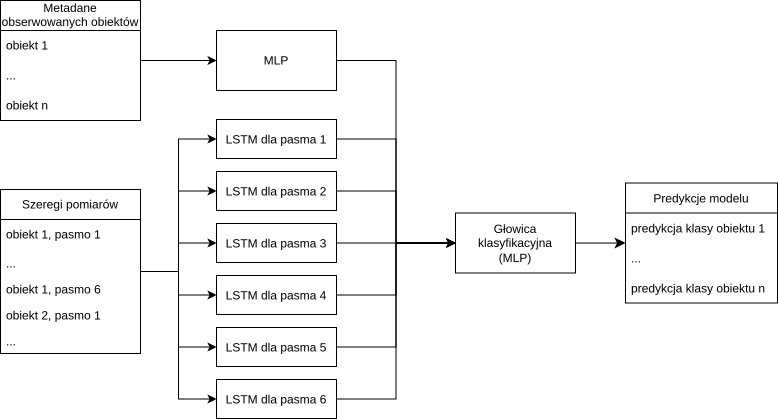

# Fizyka Ogólna - projekt nr 65 - Sprawozdanie
<!-- `pandoc -o reports/report.pdf reports/report.md -V geometry:margin=0.5in -V lang=polish -f markdown+raw_tex -V graphics=true` -->

* Mikołaj Garbowski
* Maksym Bieńkowski

## Opis zadania
Temat zadania to *AI do klasyfikacji obiektów astronomicznych na podstawie danych fotometrycznych* (oryginalnie: do klasyfikacji typów supernowy, końcowo wybraliśmy jednak zestaw danych z większą ilością klas). 

## Dane wejściowe
Zdecydowaliśmy się skorzystać z zestawu danych z konkursu [PLAsTiCC 2018](https://www.kaggle.com/competitions/PLAsTiCC-2018) zorganizowanego przez członków kolaboracji [LSST](https://lsst-tvssc.github.io/) w przygotowaniu na ogromne wolumeny danych fotometrycznych z prowadzonych pomiarów. Zestaw jest ogromny - całość waży ponad 40GB, w związku z czym działaliśmy na jego części zawierającej dane o ponad 7800 obiektach.

Zestaw podzielony był na dwie części - szeregi czasowe zawierające dane dotyczące światła obiektów oraz metadane. Poniżej format danych:

### Metadane obiektów (plik nagłówkowy, jeden wiersz = jeden obiekt)
- object_id: unikalny identyfikator obiektu  
- ra: rektascensja, współrzędna nieba (stopnie)  
- decl: deklinacja, współrzędna nieba (stopnie)  
- gal_l: długość galaktyczna (stopnie)  
- gal_b: szerokość galaktyczna (stopnie)  
- ddf: flaga logiczna, czy obiekt pochodzi z obszaru Deep Drilling Field  
- hostgal_specz: spektroskopowy redshift obiektu (dokładny, głównie w zbiorze treningowym)  
- hostgal_photoz: fotometryczny redshift galaktyki macierzystej  
- hostgal_photoz_err: niepewność redshiftu fotometrycznego  
- distmod: moduł odległości obliczony z redshiftu fotometrycznego  
- MWEBV: ekstynkcja pyłowa Drogi Mlecznej wzdłuż linii widzenia  
- target: etykieta klasy obiektu

### Dane szeregów czasowych (krzywe blasku, jeden wiersz = jedna obserwacja)
- object_id: identyfikator obiektu, klucz łączący z metadanymi  
- mjd: czas obserwacji w zmodyfikowanej dacie juliańskiej  
- passband: pasmo obserwacyjne LSST (u/g/r/i/z/y)
- flux: zmierzony strumień jasności w danym filtrze  
- flux_err: niepewność pomiaru strumienia  
- detected: flaga logiczna wykrycia istotnego statystycznie ($\le 3\sigma$)

### Uwagi
- obserwacje w różnych filtrach nie były wykonywane jednocześnie  
- obserwacje nie były wykonywane w równomiernych odstępach 

## Architektura modelu

Mając do klasyfikacji dane będące szeregami czasowymi, zdecydowaliśmy się użyć sieci LSTM (Hochreiter, 1997) ze względu na ich wysoką skuteczność i niską liczbę parametrów w porównaniu do bardziej złożonych rozwiązań, np. transformerów. Jako, że oddzielne pasma pomiaru tworzą oddzielne szeregi czasowe, w końcowym modelu zastosowaliśmy 6 oddzielnych LSTMów, jedna na każde pasmo. Reprezentacje szeregów czasowych otrzymywane na wyjściu LSTM wraz z metadanymi przekazywane były na wejście główki klasyfikacyjnej, której rolę spełniał perceptron wielowarstwowy. Poniższy diagram obrazuje tę architekturę.



## Przetwarzanie danych
Przed wytrenowaniem i ewaluacją modelu przetworzyliśmy dane, aby wycisnąć z nich jak najwięcej istotnych informacji. 

### Metadane
usunęliśmy niepotrzebne kolumny: 
* ra, decl, gal_l i gal_b - położenie obiektu na niebie nie powinno być skorelowane z jego typem, a dane pochodzą z symulacji. Istotna informacja o dystansie zawarta jest i tak w `distmod`.
* hostgal_photoz, hostgal_photoz_err - jako, że zarówno trening jak i ewaluacja przebiegał na oetykietowanych danych treningowych, które zawierały dokładnie zmierzone spektroskopowe wartości redshiftów. W nieoetykietowanym zestawie testowym, na którym ewaluowano modele w oficjalnych zawodach, w większości pomiarów brakowało danych spektroskopowych, stąd włączenie danych fotometrycznych w zestaw. Na nasze potrzeby wystarczą więc dane spektroskopowe.

dodaliśmy nowe kolumny:
* n_obs - łączna liczba obserwacji
* n_detections - łączna liczba obserwacji, gdy obiekt był wykryty
* t_span - łączny okres pomiaru, różnica czasu ostatniego i pierwszego pomiaru (w dniach)
* max snr per pasmo - heurystyka maksymalnej jasności w danym pasmie zawierająca informację o błędzie pomiaru
* mean_flux_{0-5} średnia wartość fluxu per pasmo we wszystkich pomiarach - uśredniona informacja o jasności

#### Normalizacja
Na podstawie analizy rozkładów prawdopodobieństwa poszczególnych zmiennych stosowaliśmy w większości przypadków standardową normalizację $\frac{(x-mean)}{\sigma}$. Jeśli rozkład zawierał dużo próbek o małych wartościach i długi, kilka rzędów większy ogon, stosowaliśmy transformację logarytmiczną `log1p(x) = log(1+x)`, aby uzyskać bardziej symetryczny rozkład do poddania normalizacji.

### Szeregi czasowe
usunęliśmy kolumnę mjd - data w formacie bezwzględnym nie jest tu pomocna, w szczególności jeśli dane testowe pochodzić będą z innego okresu, niż treningowe. Sieci LSTM powinny operować na względnych zmianach czasu w porównaniu do poprzedniego pomiaru.

dodaliśmy nowe kolumny:
* delta_t - wspomniana względna zmiana czasu od ostatniego pomiaru, dla pierwszego pomiaru dla danego obiektu w danym paśmie równa 0
* delta_t_cumsum - czas, który upłynął od pierwszego pomiaru obiektu w danym paśmie
* signal to noise ratio wyliczane jako `flux/flux_err` - korzystna informacja dla modelu opisująca pewność pomiaru

#### Normalizacja
Normalizowane są wszystkie dane podawane do LSTMa - istotny jest w tym przypadku ich ogólny "kształt", a klasyfikator dostaje na wejście nieznormalizowane zagregowane dane z szeregów czasowych. Dla każdego ciągu obserwacji (per obiekt i pasmo) normalizowane są wartości flux i flux_err poprzez podzielenie przez medianę wartości bezwzględnej fluxu. Mediana zamiast wartości średniej sprawia, że zaszumione skoki nie wpływają na skalę uśredniania, a wartość bezwzględna nie zmienia znaku.

## Dobór hiperparametrów i trening

Aby znaleźć optymalne hiperparametry modelu, przeprowadziliśmy przeszukiwanie ich przestrzeni (grid search) z wykorzystaniem serwisu [weights and biases](https://wandb.ai/). Wartości dokładności na zbiorze walidacyjnym wahały się w granicach 53-73%. Model o najwyższej dokładności na zbiorze walidacyjnym został wykorzystany do ewaluacji na zbiorze testowym. Poniżej zakresy parametrów stosowane w grid searchu i ich wytłumaczenie:

- learning_rate  
  - tempo uczenia sieci
  - rozkład: log-uniform  
  - zakres: 1e-4 – 3e-3

- metadata_num_hidden_layers  
  - liczba warstw ukrytych w MLP  
  - wartości: 1, 2, 3, 4, 5

- metadata_hidden_size  
  - liczba neuronów w warstwach ukrytych MLP  
  - wartości: 64, 128, 256

- metadata_output_size  
  - rozmiar wektora wyjściowego LSTMów
  - wartości: 32, 64, 128

- lightcurve_num_hidden_layers  
  - liczba warstw ukrytych w LSTMach
  - wartości: 1, 2, 3, 4, 5

- lightcurve_hidden_size  
  - liczba neuronów w warstwach ukrytych LSTMów
  - wartości: 64, 128, 256

- classifier_hidden_size  
  - liczba neuronów w warstwach ukrytych MLP
  - wartości: 128, 256, 512

- classifier_num_hidden_layers  
  - liczba warstw ukrytych MLP  
  - wartości: 1, 2, 3, 4, 5

- [dropout](https://en.wikipedia.org/wiki/Dilution_(neural_networks))
  - współczynnik regularyzacji
  - rozkład: jednostajny  
  - zakres: 0.0 – 0.4

- epochs  
  - maksymalna liczba epok treningu  
  - wartość: 100

- early_stop_patience  
  - liczba epok bez poprawy przed wczesnym zatrzymaniem  
  - wartość: 10

- batch_size  
  - liczba próbek w jednej paczce treningowej  
  - wartości: 32, 64, 128


### Hiperparametry najlepszego modelu
```python
SupernovaClassifierV1Config(
    metadata_input_size=20, 
    metadata_num_hidden_layers=5, 
    metadata_hidden_size=128, 
    metadata_output_size=128, 
    lightcurve_input_size=6, 
    lightcurve_num_hidden_layers=4, 
    lightcurve_hidden_size=64, 
    classifier_hidden_size=512, 
    classifier_num_hidden_layers=3, 
    num_classes=14, 
    dropout=0.06791426425250689
)
```

## Wyniki
Wyniki modelu, który osiągnął dokładność 73% na zbiorze walidacyjnym:
```
=== Classification Report ===
              precision    recall  f1-score   support

     Klasa 6       0.46      0.50      0.48        22
    Klasa 15       0.63      0.72      0.67        68
    Klasa 16       0.88      0.88      0.88       139
    Klasa 42       0.45      0.45      0.45       183
    Klasa 52       0.00      0.00      0.00        29
    Klasa 53       0.00      0.00      0.00         6
    Klasa 62       0.53      0.28      0.37        85
    Klasa 64       0.39      0.60      0.47        15
    Klasa 65       0.88      0.96      0.92       135
    Klasa 67       0.00      0.00      0.00        31
    Klasa 88       0.96      0.96      0.96        56
    Klasa 90       0.68      0.83      0.75       338
    Klasa 92       0.86      0.82      0.84        38
    Klasa 95       0.90      0.84      0.87        32

    accuracy                           0.70      1177
   macro avg       0.54      0.56      0.55      1177
weighted avg       0.66      0.70      0.67      1177

=== Confusion Matrix ===
[[ 11   0   6   0   0   0   0   0   3   0   0   0   2   0]
 [  0  49   0   6   0   0   1   0   0   0   0  12   0   0]
 [  0   0 122   0   0   0   0   0  13   0   1   0   3   0]
 [  2  11   0  82   0   0  12   4   0   0   0  70   0   2]
 [  0   0   0  11   0   0   1   1   0   0   0  16   0   0]
 [  6   0   0   0   0   0   0   0   0   0   0   0   0   0]
 [  2   1   0  33   0   0  24   8   0   0   0  16   0   1]
 [  1   0   0   2   0   0   2   9   1   0   0   0   0   0]
 [  0   0   5   0   0   0   0   0 130   0   0   0   0   0]
 [  0   1   0   7   0   0   4   0   0   0   0  19   0   0]
 [  0   1   0   0   0   0   0   0   0   0  54   1   0   0]
 [  2  12   0  41   0   0   1   1   0   0   0 281   0   0]
 [  0   0   6   0   0   0   0   0   0   0   1   0  31   0]
 [  0   3   0   1   0   0   0   0   0   0   0   1   0  27]]
=== Micro-Averaged Metrics ===
Accuracy: 0.70
Precision: 0.70
Recall: 0.70
F1 Score: 0.70
=== Macro-Averaged Metrics ===
Accuracy: 0.56
Precision: 0.54
Recall: 0.56
F1 Score: 0.55
==============================
```

Rozjazd między wartościami mikro i makro nie jest zaskakujący przy niezrównoważonym zbiorze. Model dość dobrze generalizuje wiedzę na danych niewykorzystywanych podczas treningu i walidacji.

## Ograniczenia i założenia na potrzeby projektu
Na koniec chcielibyśmy wytłumaczyć jedno ograniczenie modelu w obecnej formie - podczas treningu i ewaluacji używaliśmy wyłącznie niedużej części danych treningowych z punktu widzenia konkursu, zawierających dokładne redshifty spektroskopowe, co nie jest w pełni reprezentatywne dla danych obserwacyjnych LSST i oficjalnego zbioru testowego - aby podejść do problemu tak poważnie, przydałoby się wytrenować model na pełnym zestawie danych, do czego nie mieliśmy wystarczającej mocy obliczeniowej. W praktycznych zastosowaniach astronomicznych dostępne będą głównie redshifty fotometryczne oraz silniejsza nierównowaga klas, co może obniżyć skuteczność modelu.
